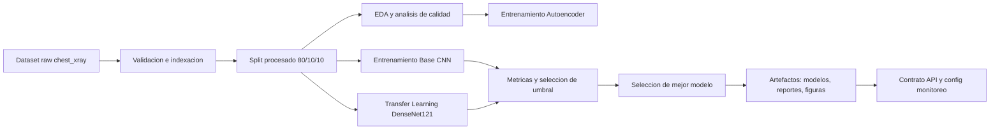
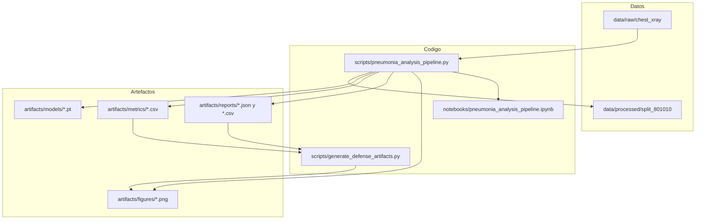

# Pipeline de deteccion de neumonia con radiografias de torax

Este README documenta el proyecto disponible en la carpeta padre de este archivo. El repositorio contiene un pipeline de ciencia de datos para preparar imagenes de rayos X de torax, entrenar modelos de clasificacion binaria y generar artefactos tecnicos para evaluacion, explicabilidad, monitoreo y un contrato de API.

El objetivo del modelo es clasificar imagenes en dos clases:

- `NORMAL`
- `PNEUMONIA`

## Contenido del proyecto

```text
../
+-- configs/
|   +-- monitoring.json
+-- data/
|   +-- raw/chest_xray/
|   +-- interim/
|   +-- processed/split_801010/
+-- notebooks/
|   +-- pneumonia_analysis_pipeline.ipynb
+-- scripts/
|   +-- execute_notebook.py
|   +-- generate_defense_artifacts.py
|   +-- generate_notebook.py
|   +-- pneumonia_analysis_pipeline.py
+-- artifacts/
|   +-- figures/
|   +-- metrics/
|   +-- models/
|   +-- reports/
+-- requirements.txt
+-- README.md
```

## Documentacion tecnica

El proyecto si contiene documentacion tecnica y artefactos de soporte:

- README claro: este documento describe la estructura, ejecucion, arquitectura, API esperada, uso y despliegue local.
- Diagramas de arquitectura: incluidos en formato Mermaid en este README.
- Documentacion de APIs: existe el contrato en `../artifacts/reports/api_contract.json`.
- Manual de usuario: incluido en la seccion "Manual de usuario".
- Guia de despliegue: incluida en la seccion "Guia de despliegue local".

No se encontro una aplicacion web, servidor FastAPI/Flask ni endpoint productivo implementado. La API esta documentada como contrato para una futura capa de servicio.

## Arquitectura

### Flujo general



### Componentes



## Modelos y resultados

El pipeline entrena y compara al menos dos clasificadores:

- `base_cnn`: red convolucional base entrenada sobre el dataset procesado.
- `densenet121_transfer`: modelo DenseNet121 con transfer learning y calibracion.

Segun `../artifacts/reports/run_summary.json`, el mejor modelo registrado es:

- Modelo: `base_cnn`
- Archivo: `../artifacts/models/base_cnn.pt`
- F1 score: `0.9674`
- Imagenes validas procesadas: `5856`
- Imagenes invalidas: `0`

Las metricas comparativas estan en `../artifacts/metrics/metrics_summary.csv`.

## Contrato de API

El proyecto contiene documentacion de API en `../artifacts/reports/api_contract.json`. El contrato define una inferencia HTTP esperada, pero no incluye el servidor que la expone.

### Endpoint esperado

```http
POST /predict
Content-Type: multipart/form-data
```

### Campo de entrada

| Campo | Tipo | Descripcion |
| --- | --- | --- |
| `file` | JPEG/PNG | Radiografia de torax |

### Respuesta esperada

```json
{
  "predicted_label": "NORMAL|PNEUMONIA",
  "pneumonia_probability": "float",
  "threshold": "float",
  "model_name": "string"
}
```

### Preprocesamiento esperado

- Modo de imagen: `RGB`
- Tamano: `224x224`
- Normalizacion: media y desviacion estandar de ImageNet

## Manual de usuario

### 1. Preparar el entorno

Desde la carpeta raiz del proyecto:

```bash
python -m venv .venv
.venv\Scripts\activate
pip install -r requirements.txt
```

### 2. Verificar el dataset

El pipeline espera que el dataset exista en:

```text
data/raw/chest_xray/
```

con la estructura:

```text
data/raw/chest_xray/
+-- train/
+-- val/
+-- test/
```

### 3. Ejecutar el pipeline completo

```bash
python scripts/pneumonia_analysis_pipeline.py
```

El modo completo entrena los modelos, calcula metricas, genera visualizaciones y exporta artefactos.

### 4. Ejecutar una verificacion rapida

```bash
$env:RUN_PROFILE = "verify"
python scripts/pneumonia_analysis_pipeline.py
```

Este perfil usa subconjuntos y menos epocas para validar que el flujo funciona sin ejecutar todo el entrenamiento.

### 5. Regenerar el notebook

```bash
python scripts/generate_notebook.py
```

El notebook se genera desde `scripts/pneumonia_analysis_pipeline.py`, que actua como fuente principal.

### 6. Ejecutar el notebook por consola

```bash
python scripts/execute_notebook.py notebooks/pneumonia_analysis_pipeline.ipynb
```

### 7. Generar artefactos para defensa

```bash
python scripts/generate_defense_artifacts.py
```

Este script usa metricas y predicciones existentes para crear visualizaciones y resumenes adicionales en `artifacts/figures/` y `artifacts/reports/`.

## Artefactos generados

- Modelos entrenados: `../artifacts/models/`
- Metricas: `../artifacts/metrics/`
- Figuras: `../artifacts/figures/`
- Reportes tecnicos: `../artifacts/reports/`
- Configuracion de monitoreo: `../configs/monitoring.json`

Ejemplos relevantes:

- `../artifacts/reports/api_contract.json`
- `../artifacts/reports/run_summary.json`
- `../artifacts/metrics/metrics_summary.csv`
- `../artifacts/figures/base_cnn_gradcam_comparison.png`
- `../artifacts/figures/defense_executive_dashboard.png`

## Guia de despliegue local

Este proyecto no contiene una aplicacion productiva empaquetada ni un servidor de inferencia. El despliegue disponible es local y orientado a reproducir entrenamiento, evaluacion y artefactos.

### Requisitos

- Python 3.13 o compatible con las dependencias instaladas.
- Dependencias de `requirements.txt`.
- Dataset `Chest X-Ray Images (Pneumonia)` ubicado en `data/raw/chest_xray/`.
- Espacio en disco para modelos, metricas, figuras y cache de Torch.

### Pasos

```bash
python -m venv .venv
.venv\Scripts\activate
pip install -r requirements.txt
python scripts/pneumonia_analysis_pipeline.py
```

Al terminar, validar:

```text
artifacts/models/base_cnn.pt
artifacts/metrics/metrics_summary.csv
artifacts/reports/run_summary.json
artifacts/reports/api_contract.json
configs/monitoring.json
```

### Consideraciones para exponer la API

Para convertir el contrato en un servicio real se debe implementar una capa HTTP, por ejemplo con FastAPI o Flask, que:

- cargue `artifacts/models/base_cnn.pt`;
- replique el preprocesamiento definido en `api_contract.json`;
- acepte `POST /predict` con `multipart/form-data`;
- devuelva la respuesta documentada;
- registre metricas operativas y aplique los umbrales de `configs/monitoring.json`.

## Monitoreo

La configuracion de monitoreo se encuentra en `../configs/monitoring.json` e incluye:

- modelo seleccionado;
- ruta del modelo;
- umbral de drift de entrada;
- F1 minimo;
- recall minimo;
- politica de reentrenamiento por bajo recall o drift.

## Limitaciones conocidas

- No hay servidor API implementado; solo existe el contrato esperado.
- No hay pruebas automatizadas dedicadas en una carpeta `tests/`.
- El entrenamiento puede tardar bastante en CPU.
